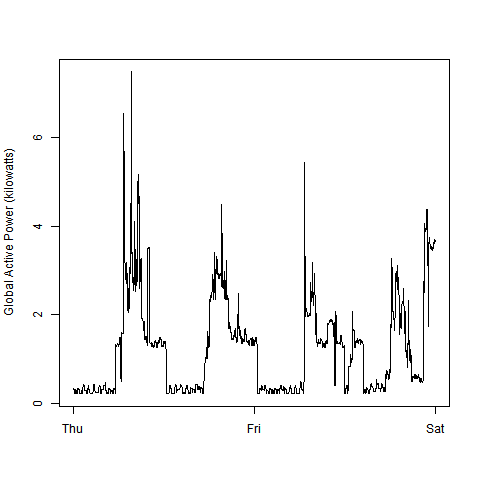
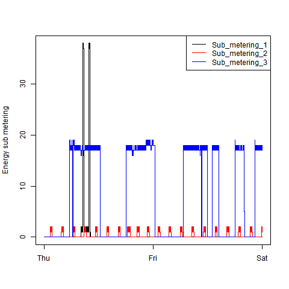
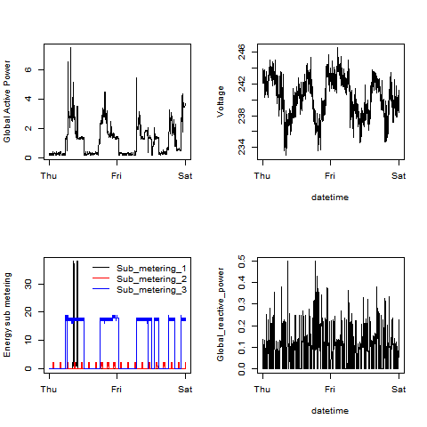

## Project Details

This is my submission for **Exploratory Analysis Project 1**.  The purpose of this project is to show applied knowledge of how to use R to load, prepare and analyze a dataset using preliminary graphs generated with R's Base plotting system.

To replicate the datasets and analysis charts, either fork this repo or copy the files down to a directory.  Set it as your working directoy and run the script named **prepdata.R**.

**prepdata.R** will install and load library dependencies if they are not already in your R configuration.  It will then download, unzip the file contents into a subfolder named "data".  Then it will load the data file into a data frame, process the data to setup types and the extra datetime column.  Finally, it will generate the 4 specified graphs and store a PNG version of each in the "images" subfolder of the working directory.

------

## Experiment Details

The dataset used for this project is the result of an [experiment that observed electric power consumption in one household over a period of 4 years in 1 minute intervals](https://archive.ics.uci.edu/ml/datasets/Individual+household+electric+power+consumption)

It is comprised of *9 variables with 2,075,259 observations* (rows) recorded.  Download the [original dataset](https://d396qusza40orc.cloudfront.net/exdata%2Fdata%2Fhousehold_power_consumption.zip)

------

## Data Preparation

Our analysis and resulting graphs required isolating the observations collected between *2/1/2007 and 2/2/2007*.  This created an analysis dataset with *10 variables and 2,880 obeservations*.  An additonal variable, **obsDateTime** was added as the 10th in order to create a proper datetime field instead of depending solely on 2 separate fields for date and time calculations.

To isolate the necessary observations, the initial dataset was loaded into a data frame and then using a subset that limited the selection to the specified dates, the analysis dataset was created.  I attempted to use other methods to load the data and isolate the required observations, such as using chunking read methods,to complete data intake in one step but this consumed a lot of time as all attempts resulted in tables with factors or that required further type conversion on multiple columns.  I opted for loading the dataset using readr's read_delim because it gave me the necessary control to load data without factors and also to determine the variable types for the majority of the variables.  Given more time I could have created custom types to handle the remaining variable conversions during data load and found the best method for data chunking but prior attempts to chunk lead to funky data after conversion.

After the final dataset was ready, I moved on to the creation of the plotting scripts that were necessary to reproduce the graphs that are available in the [project repo](https://github.com/rdpeng/ExData_Plotting1)

-----

## Analysis and Graphing

To allow for simple maintenance, modularity and scalability, each plot script was created in its own R file which is sourced by the main data preparation script.  This provided more control and allowed access to the same environment without having to create and designate a specific environment for the project or creating a copy of the dataset for each plot script.  Reproduction of the visualization was simple due to the extra step of creating a true datetime field instead of trying to plot the graphs using 2 fields to represent the date and time.

The original graphs from the project repo are on the left with my resulting reproductions on the right:

|          Originial          |        Extra-Crispy      |
------------------------------|---------------------------
|||
|||
|||
|||

